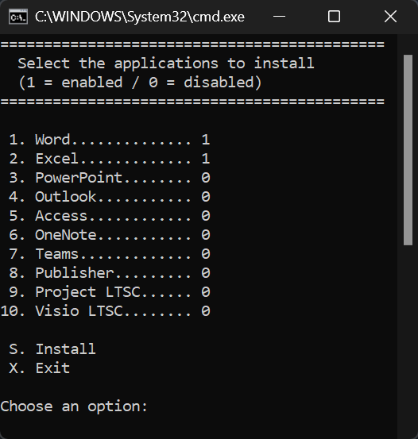

<!--Template repository to create new repositories.
Fill the content whith any you want.-->
<!--

   <h2>Office 2024 LTSC - Batch Installer</h2>
   Short descritpion in a image, logo or text.

-->

   
<!-- Badges - Replace projectName with the name of the project also, change or add the link-->

<!--

-->
<!-- Tag badges

-->
<!-- Nuget badges

-->
<!--

-->

---

# Office 2024 LTSC - Batch Installer
This is a customizable, interactive, and user‑friendly batch‑based installer for [Microsoft Office 2024 LTSC](https://learn.microsoft.com/en-en/office/ltsc/2024/overview). 
The script is released under the [MIT License](./LICENSE.md), while Microsoft Office is covered by its own [Microsoft license](https://learn.microsoft.com/en-en/office/volume-license-activation/plan-volume-activation-of-office).

<!--
## Table of Contents
- [Getting Started](#getting-started)
- [Requirements](#Requirements)
- [Install - Option 1](#Option-1)
- [Install - Option 2](#Option-2)
- [Support Development](#Support-development)

# Getting Started

This document provides instructions for downloading, configuring, and installing Microsoft Office 2024 LTSC using either a customizable batch installer or the official Microsoft deployment method.
-->

---

## Requirements

Before proceeding, download the official **[Office Deployment Tool (ODT)](https://learn.microsoft.com/es-es/office/ltsc/2024/deploy#download-the-office-deployment-tool-from-the-microsoft-download-center)**:

Running the tool will extract the following files:

- `setup.exe`
- `configuration-Office365-x64.xml`

The `setup.exe` file is required for installation, while the XML file is safe to delete.

* * *

## How to install

### Option 1 (User-friendly GUI)

This method allows you to interactively select which Office applications to install.

1. Download the latest release of [Setup_Office_2024_LTSC.zip](https://github.com/Astorcamon/Office2024LTSC-BatchInstaller/releases)
2. Extract and place the files it in the same directory as `Setup.exe`.   
3. Run the batch file **as Administrator**.
4. Select the applications to install by entering the corresponding number.
  - Each application shows its status as **=1 (Enabled)** or **=0 (Disabled).**
4. Enter **S** to begin the installation.

This option is recommended for users who want a simple, menu‑based installation process.

---

### Option 2 (For Advanced Users)

This method uses Microsoft’s official configuration and deployment workflow.

1. Generate a custom XML configuration using the online [Configuration Tool](https://config.office.com/deploymentsettings)
2. Save the generated XML file in the same folder as `setup.exe`.  
3. Open **Command Prompt as Administrator** in that folder.  
4. Download the Office installation files: `setup.exe /download configuration.xml`  
5. Once the download completes, install Office: `setup.exe /configure configuration.xml`  

This option is recommended for IT administrators or advanced users who need full control over deployment settings.

<!--
# Documentation
Links to documentation

-->

## Screenshots

## Support Development

<Table>
   <th>Paypal</th>
   <th>Github</th>
   <th>Ko-Fi</th>
  <tr>
    <td></td>
    <td></td>
    <td></td>
  </tr>
</table>
